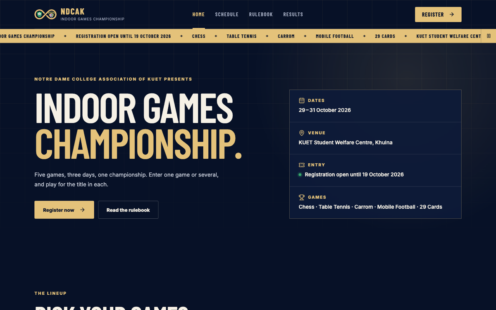
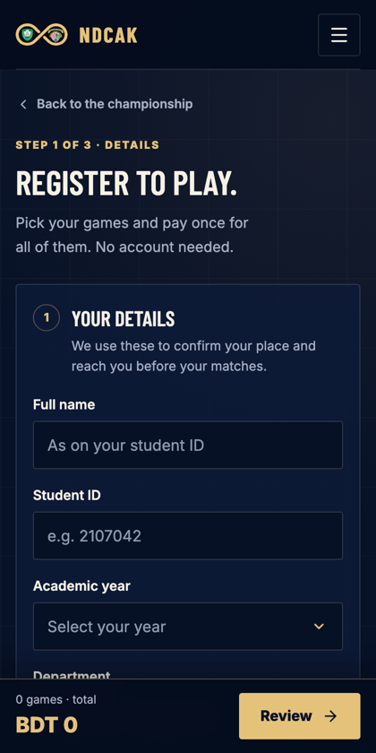
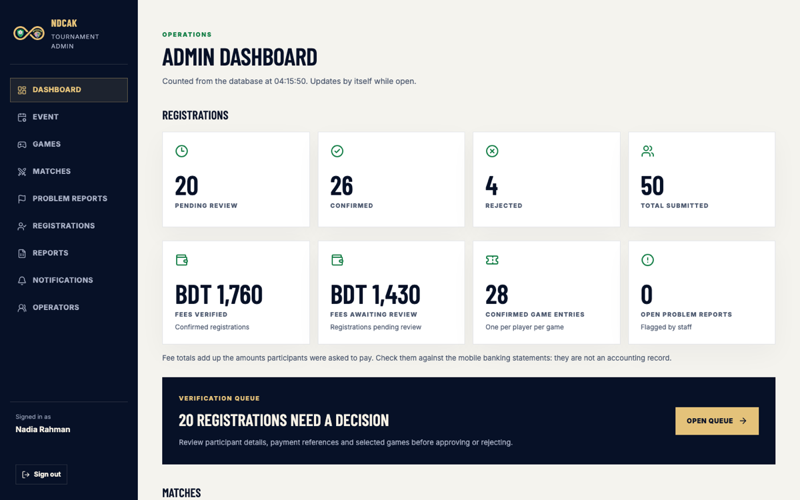
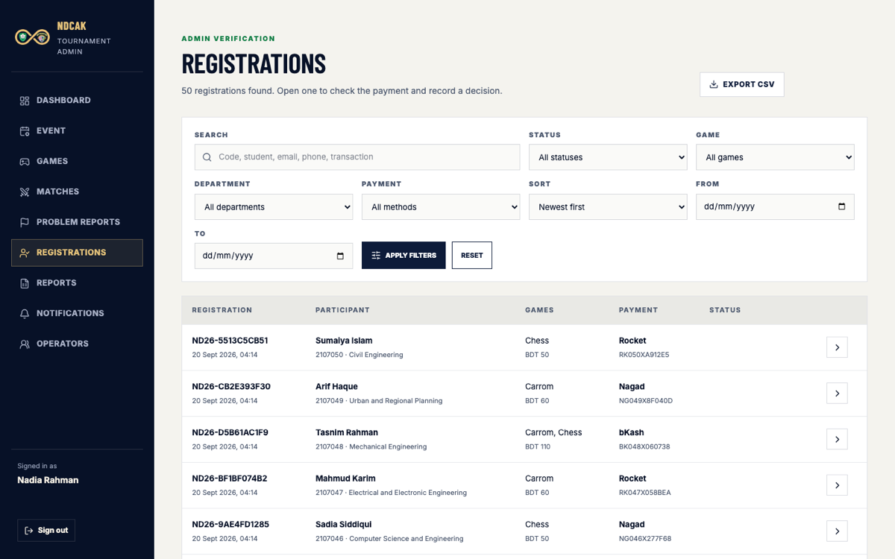
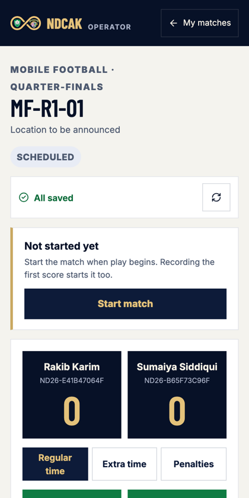
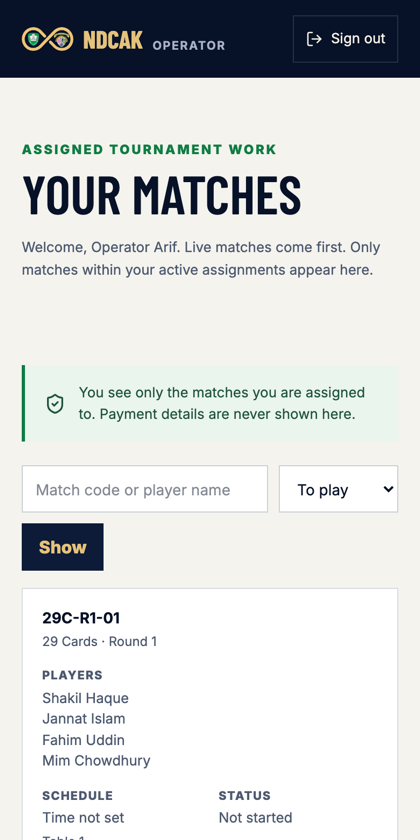
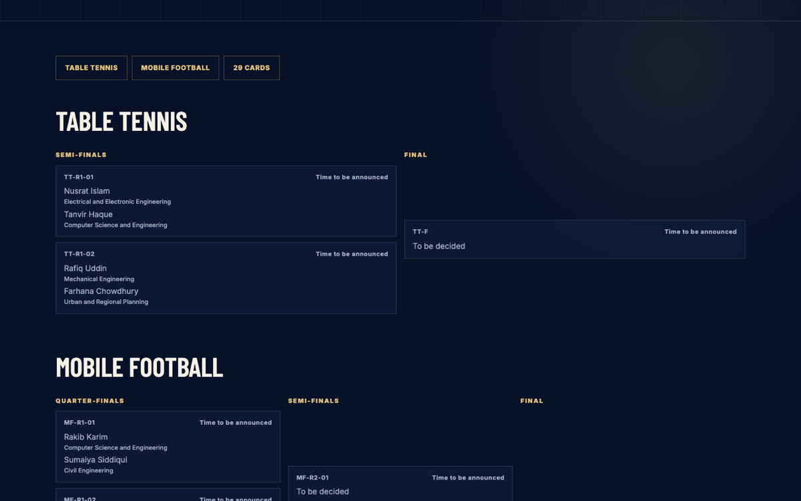

# NDCAK Indoor Games Championship

The tournament platform of the Notre Dame College Association of KUET: students
register and pay for several games in one go, the committee verifies payments,
and score operators run the matches from their phones on the day.

Live: **https://ndcak-indoor-games.vercel.app**



## What it does

**For students.** No account, no app. Fill in your details, pick any games you
want, pay the total once by bKash, Nagad or Rocket, and enter the transaction
ID. Your place is held while the committee checks the payment, and the
confirmation email carries a calendar invite.



**For the committee.** One workspace for the whole event: a verification queue
with every payment detail, event and game settings, draws, a live match
monitor, problem reports from the floor, five CSV exports and a log of every
email.





**For score operators.** Each operator sees only the matches they are assigned
to, with a scoring screen built for the game in hand. Scores entered without
signal wait on the phone and send themselves; two operators on one match can
never overwrite each other silently.




**In public.** Schedule, rulebook and, once the committee publishes them,
results and brackets.



## Features

| Area           | What you get                                                                                                                                                                                           |
| -------------- | ------------------------------------------------------------------------------------------------------------------------------------------------------------------------------------------------------ |
| Registration   | Account-free, multi-game, fees and capacity calculated on the server, duplicate entries and reused transaction IDs refused, drafts kept on the device                                                  |
| Payments       | Mobile banking instructions per method, manual verification by the committee, approval or rejection with a reason, capacity released on rejection                                                      |
| Staff accounts | Super Admin and score operators, email invitations, assignments by tournament, game, round, match or player entry, each with its own capabilities                                                      |
| Scoring        | Seven scoring types (chess outcome, goals, sets, carrom, multiplayer points, score comparison, placement points), knockout draws with byes or manual rounds, corrections and walkovers, full match log |
| Reliability    | Every action is idempotent, scores are an append-only log with per-match versions, offline queue on the phone, stale updates refused with the current state                                            |
| Live           | Staff screens update in about a second through private Supabase Realtime channels, with polling underneath so nothing depends on the socket                                                            |
| Communication  | Registration, approval, rejection, operator invitation and reminder emails, all recorded and retryable                                                                                                 |
| Reporting      | Dashboard counted from the database, plus CSV exports for registrations, players, payments, results and operator activity                                                                              |
| Operations     | Daily scheduled job, health endpoint, backups with a verified restore, emergency admin access, event-day runbook                                                                                       |

## Built with

Next.js 16 (App Router, React 19), TypeScript, PostgreSQL on Supabase with
Drizzle ORM, Supabase Auth for staff sessions, Supabase Realtime for staff
screens, Gmail SMTP for email, and Vercel for hosting. It runs inside the free
tiers of both Supabase and Vercel.

## Run it locally

You need Node 24, pnpm 12, a Supabase project (for staff sign-in) and a local
PostgreSQL for the tests.

```bash
pnpm install
cp .env.example .env.local     # fill in the Supabase, database and email values
pnpm db:migrate                # create the schema
pnpm db:invite-admin -- --local --print   # a link to set the Super Admin password
pnpm dev                       # http://localhost:3000
```

`pnpm readiness:check` reports anything still missing, without changing data or
sending email.

## Tests

```bash
pnpm test              # unit tests, no database needed
pnpm test:integration  # against a local PostgreSQL, see docs/qa/INTEGRATION_TESTS.md
pnpm test:e2e          # browser tests, see docs/qa/END_TO_END_TESTS.md
pnpm typecheck && pnpm lint
```

The browser suite builds the app, seeds a local database through the app's own
services, starts a local mail sink and drives real flows: registration, admin
review, operator invitations and scopes, two operators on one match,
accessibility (WCAG 2.1 AA), keyboard use, five screen widths and the security
headers.

## Deploy

```bash
pnpm vercel:env        # copy production settings from .env.local
vercel deploy --prod
```

Details, including the daily job and the one dependency patch, are in
[docs/operations/DEPLOYMENT.md](docs/operations/DEPLOYMENT.md).

## Running an event

[docs/operations/EVENT_DAY_RUNBOOK.md](docs/operations/EVENT_DAY_RUNBOOK.md)
covers the weeks before, the day itself, what to do when something breaks,
backups and emergency access. It is written for the committee, not for
developers.

## Where things live

```
src/app         pages and routes (public, admin, operator, staff, API)
src/features    the work itself: registration, admin, operators, matches,
                scoring, notifications, issues, analytics, event settings
src/db          schema and migrations
src/lib         database client, email, realtime signals, rate limits
tests           unit, integration and browser tests
docs            product, architecture, operations, QA and planning notes
scripts         backups, admin access, readiness and deployment helpers
```

## Documentation

- [Product brief](docs/product/PRODUCT_BRIEF.md) and the full PRD in `docs/product`
- [System architecture](docs/architecture/SYSTEM_ARCHITECTURE.md),
  [data model](docs/architecture/DATA_MODEL.md),
  [authorization](docs/architecture/AUTHORIZATION.md),
  [scoring and realtime](docs/architecture/SCORING_AND_REALTIME.md)
- [Deployment](docs/operations/DEPLOYMENT.md) and the
  [event day runbook](docs/operations/EVENT_DAY_RUNBOOK.md)
- [Status and decisions](docs/planning/STATUS.md), with a completion record per
  phase in `docs/planning`

## Who built it

See the [developers page](https://ndcak-indoor-games.vercel.app/developers).
It is fed by `src/app/developers/developers.json`: add a person there and the
page updates, no admin panel involved.

Screenshots on this page come from the demo data the test suite seeds, not from
real participants.
