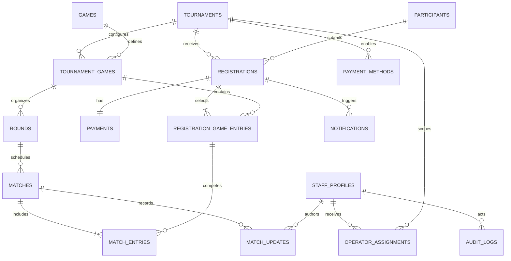

# Data Model

## Core relationships

## Modeling choices

- IDs use UUIDs for external-safe references; human registration and match codes remain separately indexed.
- Money is stored as integer BDT minor units.
- Status values use PostgreSQL enums where the lifecycle is closed and stable.
- Configurable scoring and rules use JSONB only at the game-specific boundary; canonical placements remain relational.
- `match_entries` avoids any two-player assumption.
- `operator_assignments` uses nullable resource references constrained by `scope_type`.
- Records with history are archived/deactivated, not destructively deleted.
- Every mutable aggregate includes timestamps; matches also include an integer concurrency version.

## Critical invariants

- One registration code is unique within a tournament.
- One game entry exists per registration and tournament game.
- One payment exists per registration in V1.
- A normalized transaction reference is unique per provider when accepted by policy.
- A match entry belongs to the same tournament game as its match.
- Capacity cannot be lowered below reserved plus confirmed usage without an audited override.
- Approval/rejection can transition only from `PENDING_REVIEW`.
- Finalization can succeed only when the submitted match version equals the stored version.
- Assignment target columns must match the declared scope and tournament.

## Required indexes

- `registrations(tournament_id, status, submitted_at, id)`.
- `registrations(tournament_id, code)` unique.
- `participants(normalized_student_id)`.
- `registration_game_entries(tournament_game_id, status)`.
- `payments(provider, transaction_id_normalized)`.
- `rounds(tournament_game_id, sequence)`.
- `matches(round_id, status, scheduled_at, id)`.
- `operator_assignments(operator_id, active, tournament_id)`.
- `audit_logs(created_at, id)` with actor/action/entity indexes for filtered views.
- `notifications(status, created_at, id)`.

## Transaction boundaries

- Final registration submission.
- Admin registration approval or rejection.
- Assignment replacement/revocation with audit.
- Match score update/finalization and progression.
- Match reopen/correction and dependent progression reconciliation.
