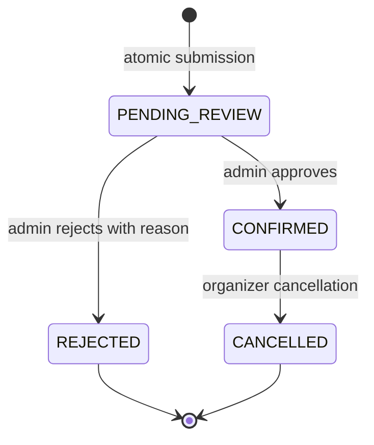
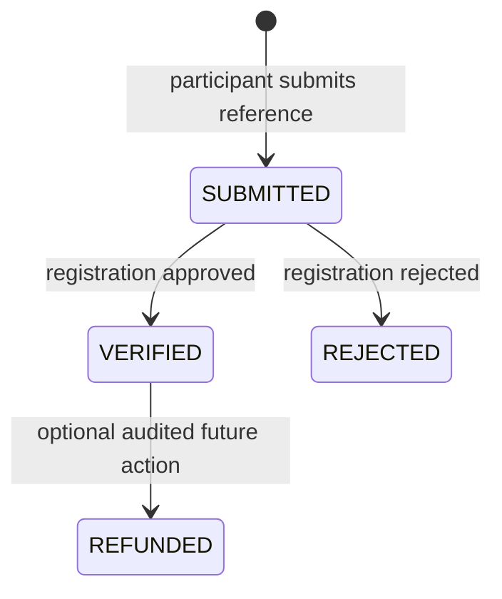
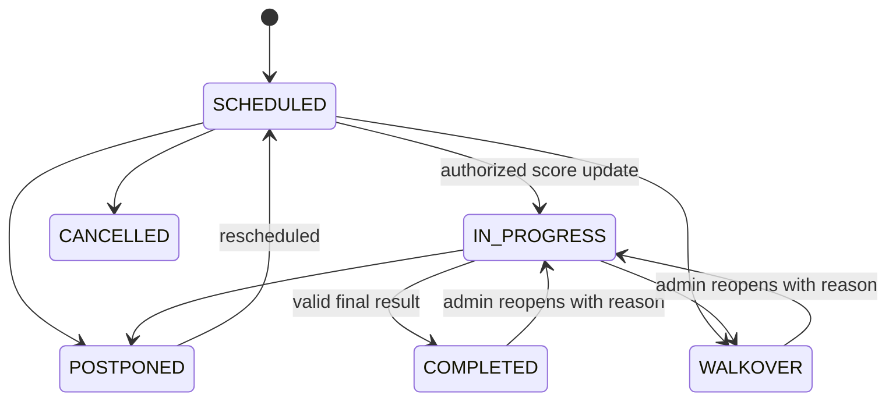
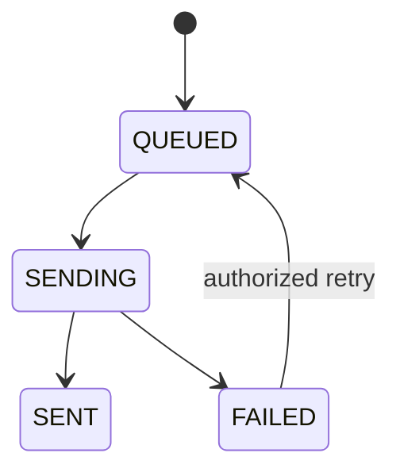

# State Flows

## Registration lifecycle

Approval confirms payment and every selected game entry in one transaction. Rejection rejects related state and releases every pending reservation in one transaction.

## Payment lifecycle

## Match lifecycle

## Notification lifecycle

Notification outbox records are committed atomically with authoritative state. Delivery starts only after that transaction commits, and delivery failures never reverse registration or match state.
