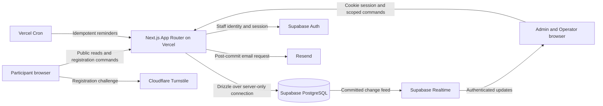
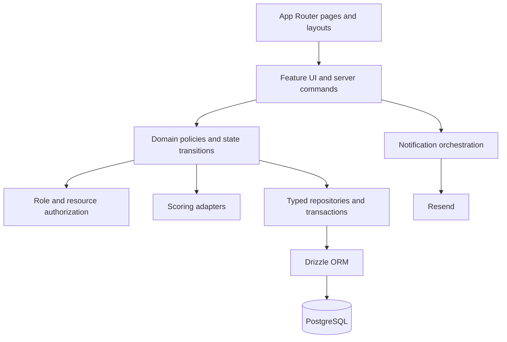
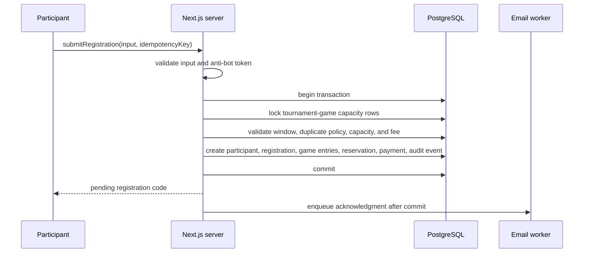
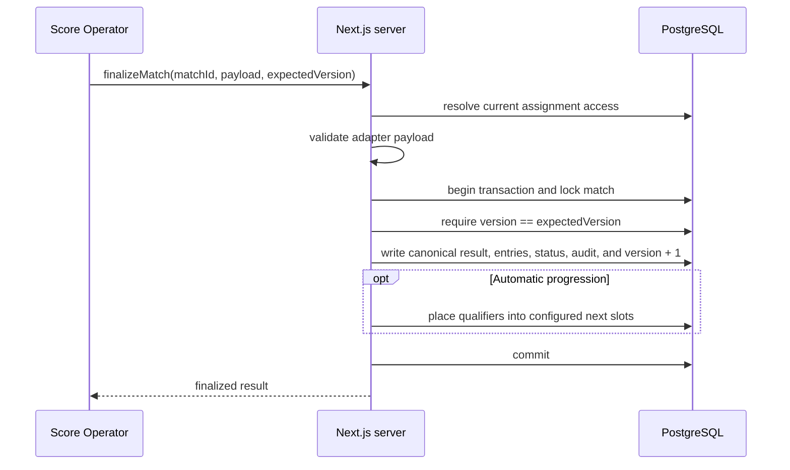

# System Architecture

## Runtime context



## Trust boundaries

- The browser never receives the database URL, Supabase secret/service key, Resend key, or Turnstile secret.
- Public and staff mutations enter through typed server actions or route handlers.
- Server-side Zod schemas validate external input before domain services run.
- Drizzle owns application schema, migrations, and transactional query logic.
- Supabase Auth establishes identity; application authorization resolves role and assignment scope.
- Realtime delivers notifications only. Reads after reconnect always come from authoritative queries.
- Email delivery begins after transaction commit and records independent delivery status.

## Application layers



Pages compose feature modules. They do not implement capacity, authorization, progression, or payment state rules.

## Registration submission



## Registration review

```mermaid
sequenceDiagram
    participant A as Super Admin
    participant W as Next.js server
    participant D as PostgreSQL
    participant E as Email worker

    A->>W: approve or reject registration
    W->>W: resolve authenticated Super Admin
    W->>D: begin transaction and lock registration
    W->>D: verify pending state
    alt Approve
        W->>D: verify payment, confirm registration and entries, finalize reservations
    else Reject
        W->>D: reject payment, registration, and entries; release reservations
    end
    W->>D: append audit event and commit
    W->>E: enqueue decision email after commit
    W-->>A: reviewed state
```

## Match finalization



## Failure strategy

- Domain failures return explicit error codes instead of leaking stack traces.
- Retried commands use idempotency/state checks.
- Stale match writers receive a conflict and current-state reload guidance.
- Email and realtime failure never invalidate committed registration or match state.
- Destructive deletion is replaced by inactive/archived state when dependent records exist.
