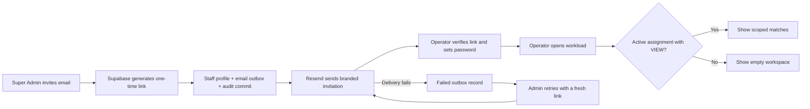

# Phase 3 - Operators and Assignments

Status: implementation ready; live staff rehearsal pending external configuration.

## Delivered

- Super Admin operator directory, invite action, account deactivation/reactivation, and audited assignment grant/revoke actions.
- Branded Resend invitation with a Supabase Auth invite or recovery link, delivery status, and manual retry.
- Staff password setup after link verification.
- All five additive scope types with separate `VIEW`, `SCORE_UPDATE`, `FINALIZE_MATCH`, and `ISSUE_REPORT` capabilities.
- Server-side match workload filtering before pagination. Operator queries select match operations data only, never payments or transaction references.
- Additive staff-email migration applied to the live Supabase database; unique case-insensitive email index verified.
- Unit checks for each scope, unrelated resources, capability mismatch, inactive staff, revocation, and generated SQL structure.

## Invitation and access flow

## Evidence

- `pnpm format:check`, `pnpm typecheck`, `pnpm lint`, `pnpm test`, and `pnpm build` pass.
- Seven email preview states return HTTP 200 in development; the route is coded to return 404 outside development.
- Browser-reviewed the branded email at desktop and mobile sizes. All seven states pass 14 Playwright viewport checks for complete height, visible support footer, and no horizontal overflow.
- Anonymous `/operator` and `/admin/operators` requests redirect to staff sign-in.
- Live database reports `staff_profiles.email` and `staff_profiles_email_uidx` present; there are still zero staff profiles.

## Still required before Phase 3 exit

1. Create the official Super Admin Auth user and run `pnpm db:bootstrap-admin`.
2. Add `SUPABASE_SECRET_KEY` to ignored `.env.local` for server-only Auth Admin link generation.
3. Verify an NDCAK-controlled sender domain in Resend and update `EMAIL_FROM`.
4. Configure committee-approved tournament/game data, then invite one test operator and verify each scope against actual matches.
5. Inspect authenticated staff pages visually after a real Super Admin and operator account exist. The email preview has already passed browser review.

Do not mark Phase 3 complete or begin score mutation work until the live invite and scope rehearsal passes.
