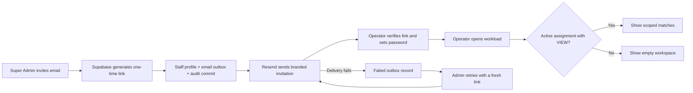

# Phase 3 - Operators and Assignments

Status: complete except invitation delivery to a separate inbox, which waits on the Gmail App Password and a deployed URL.

Follow the [Phase 3 activation runbook](../operations/PHASE_3_ACTIVATION.md) and run `pnpm readiness:check` as each external prerequisite is completed.

## Delivered

- Super Admin operator directory, invite action, account deactivation/reactivation, and audited assignment grant/revoke actions.
- Branded Resend invitation with a Supabase Auth invite or recovery link, delivery status, and manual retry.
- Staff password setup after link verification.
- All five additive scope types with separate `VIEW`, `SCORE_UPDATE`, `FINALIZE_MATCH`, and `ISSUE_REPORT` capabilities.
- Server-side match workload filtering before pagination. Operator queries select match operations data only, never payments or transaction references.
- Additive staff-email migration applied to the live Supabase database; unique case-insensitive email index verified.
- Unit checks for each scope, unrelated resources, capability mismatch, inactive staff, revocation, and generated SQL structure.

## Invitation and access flow

## Evidence

- `pnpm format:check`, `pnpm typecheck`, `pnpm lint`, `pnpm test`, and `pnpm build` pass.
- Seven email preview states return HTTP 200 in development; the route is coded to return 404 outside development.
- Browser-reviewed the branded email at desktop and mobile sizes. All seven states pass 14 Playwright viewport checks for complete height, visible support footer, and no horizontal overflow.
- Anonymous `/operator` and `/admin/operators` requests redirect to staff sign-in.
- Live database reports `staff_profiles.email` and `staff_profiles_email_uidx` present. The official active Super Admin profile now exists.
- The server-only Supabase key works with the Auth Admin API. The official Admin setup email was delivered and accepted; the Auth user is confirmed with a password set.

## Exit criteria

| Exit criterion                                                          | Evidence                                                                                                                                                                                         |
| ----------------------------------------------------------------------- | ------------------------------------------------------------------------------------------------------------------------------------------------------------------------------------------------ |
| Admin can create/deactivate operators and grant/revoke additive scopes. | Operator directory, detail page and audited actions. Integration tests grant, combine and revoke scopes through `grantOperatorAssignment` and `revokeOperatorAssignment`.                        |
| All five scopes resolve correctly.                                      | `tests/integration/operator-scopes.test.ts` checks whole-tournament, game, round, match and participant-entry scopes against real PostgreSQL, plus combined grants and cross-tournament targets. |
| Operators cannot view payments or unrelated resources.                  | Workload queries select match data only. A signed-in test operator with a Chess game scope saw only the two Chess matches and was redirected away from `/admin`.                                 |
| Permission combinations and revocation are tested.                      | Capability limits (VIEW vs SCORE_UPDATE), revocation, inactive staff and non-operator grants are covered by the integration suite.                                                               |

## Remaining before production use

1. Set the Gmail App Password (`SMTP_USER`/`SMTP_PASSWORD`); then invite one real operator from `/admin/operators` and confirm the email arrives and the link works on another device.
2. Deploy to a public URL so invitation links do not point at `localhost`.

Neither item blocks Phase 4 development: match creation and scoring can be built and tested against the local database.
