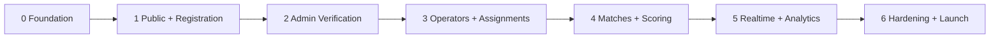

# Seven-Phase Delivery Roadmap

The phases follow the PRD's 0-6 sequence. Each phase must satisfy its exit criteria before the next phase is treated as complete, though low-risk groundwork may overlap.

## Phase 0 - Foundation

Build the reliable base: project tooling, design tokens, documentation, environment contract, schema/migrations, staff auth skeleton, and deployment-ready structure.

Exit criteria:

- Local app, lint, type checking, unit tests, and production build pass.
- Design tokens and public/staff layout primitives are established.
- Drizzle schema and initial migration are repeatable.
- Supabase staff-session boundary is implemented without exposing privileged credentials.
- Environment validation fails clearly when required production values are absent.

## Phase 1 - Public Site and Registration

Deliver the public event experience and complete account-free registration journey: form, review, payment, transactional submission, pending confirmation, and acknowledgment email record.

Exit criteria:

- A mobile participant can select multiple configured games and submit once.
- Fee and capacity logic is shared, server-authoritative, and covered by tests.
- Final submission is atomic and cannot oversubscribe capacity.
- Duplicate active registration and provider transaction rules are enforced.
- Submitted state and email language consistently say pending review.

## Phase 2 - Admin Verification

Deliver the operational registration queue, focused review, approval/rejection transactions, notification processing, and calendar invitation generation.

Exit criteria:

- Admin can search, filter, sort, and paginate server-side without losing URL state.
- Approval and rejection are idempotent, atomic, and audited.
- Rejection releases capacity; approval finalizes it.
- Email failures do not roll back authoritative database state and can be retried.

## Phase 3 - Operators and Assignments

Deliver staff account lifecycle, role resolution, assignment management, and operator workload queries.

Exit criteria:

- Admin can create/deactivate operators and grant/revoke additive scopes.
- Whole-tournament, game, round, match, and participant-entry scopes resolve correctly.
- Operators cannot view payments or unrelated resources.
- Permission combinations and revocation are covered by unit/integration tests.

## Phase 4 - Matches and Scoring

Deliver rounds, multi-competitor matches, scoring adapters, score entry, finalization, progression, correction, concurrency protection, and match audit history.

Exit criteria:

- Supported games use adapter-specific forms and server validation.
- Two or more operators can work safely without stale overwrites.
- Single-elimination progression supports byes; manual progression remains available.
- Completed result correction is controlled and downstream dependencies are reconciled.

## Phase 5 - Realtime, Analytics, and Communication

Add event-day awareness after core correctness: staff realtime updates, operational metrics, filtered exports, reminders, and issue reporting.

Exit criteria:

- Staff views update near real time but remain correct after disconnect/reload.
- Dashboard metrics are derived from authoritative state with explicit labels.
- Exports respect filters and represent the full server-side result set.
- Reminder jobs are idempotent and delivery is observable.

## Phase 6 - Hardening and Launch

Complete responsive, accessibility, performance, security, load, recovery, and event-day rehearsal work.

Exit criteria:

- Critical flows pass unit, integration, and end-to-end suites.
- Registration, operator score entry, and admin review pass target viewport checks.
- WCAG 2.1 AA checks and keyboard operation pass.
- Last-slot concurrency and stale-match scenarios pass under realistic load.
- Backup/restore, emergency admin access, monitoring, and event-day runbook are rehearsed.

## Delivery order

